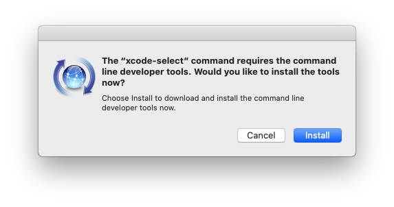
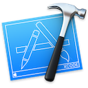

# macOS Development Setup

A macOS development environment setup guide and installation scripts.

![Release-macOS-doc][release-macos-shield] [![License][license-shield]](LICENSE.md) [![Twitter][twitter-shield]](https://twitter.com/mgomesborges)

## Command Line Tools (mandatory)


The Command Line Tools Package is a small self-contained package available for download separately from Xcode and that allows you to do command line development in macOS.

### Install Command Line Tools

1. Paste that in the terminal prompt:

    ```bash
    xcode-select --install
    ```

2. A software update popup window will appear. Click `Install`, then agree to the Terms of Service when requested.

    

3. The Command Line Tools is installed at:

    ```bash
    /Library/Developer/CommandLineTools/
    ```

## Xcode (optional)



[Xcode](https://developer.apple.com/xcode/) is Apple's integrated development environment (IDE) for Swift, Objective-C, C, and C++. It also supports Java, AppleScript, Python, Ruby, and ResEdit (Rez).

### Install Xcode

Download and install Xcode from the [App Store](https://apps.apple.com/us/app/xcode/id497799835?mt=12) or from [Apple's website](https://developer.apple.com/xcode/)

:red_circle: WARNING: Xcode takes over 13 GB of disk space. Its installation is not mandatory.

## Homebrew (mandatory)


[Homebrew](https://brew.sh) is the missing package manager for macOS.

### Install Homebrewv

Open the terminal and run the following script:

```bash
/usr/bin/ruby -e "$(curl -fsSL https://raw.githubusercontent.com/Homebrew/install/master/install)"
```

## Git (mandatory)


[Git](https://git-scm.com) is a free and open source distributed version control system.

### Install Git

Run on the terminal:

```bash
brew install git
```

### Configure Git

Paste that in the terminal:

```bash
git_config_global() {
    printf "\nGit configuration - Ctrl+C to cancel\n"

    printf "\nUser name (example: M Gomes-Borges) : "
    read -r GIT_USER_NAME

    printf "\nE-mail (example: git@gomes-borges.com): "
    read -r GIT_USER_EMAIL

    # Set git user name and email
    git config --global user.name "${GIT_USER_NAME}"
    git config --global user.email "${GIT_USER_EMAIL}"

    # Set git terminal colors
    git config --global color.ui true
    git config --global color.status.changed "blue normal"
    git config --global color.status.untracked "red normal"
    git config --global color.status.added "magenta normal"
    git config --global color.status.updated "green normal"
    git config --global color.status.branch "yellow normal bold"
    git config --global color.status.header "white normal bold"

    printf "\nGit setup completed\n"
}

git_config_global
```

### Check Git configuration

Check your name and e-mail:

```bash
git config --global --list

# user.name=Your User Name
# user.email=your@email.com
# ...
```

## Terminal

 

With macOS Catalina - October 2019, Apple is now using Zsh as the default shell. However, you can quickly switch back to Bash if you prefer.

Check out how to select your shell and set up your terminal theme:

* [Bash tutorial](./docs/terminal-bash-setup.md)
* [Zsh tutorial](./docs/terminal-zsh-setup.md)

## Python


[Python](https://www.python.org) is a programming language that lets you work quickly
and integrate systems more effectively.

### Intall Pyenv

[Pyenv](https://github.com/pyenv/pyenv) lets you easily switch between multiple versions of Python. It's simple:

1. Install pyenv:

    ```bash
    brew install pyenv
    ```

2. Install pyenv-virtualenvwrapper :

    ```bash
    brew install pyenv-virtualenvwrapper
    ```

### Install Python

1. Init Pyenv:

    ```bash
    eval "$(pyenv init -)"
    ```

2. List the available Python versions:

    ```bash
    pyenv install --list
    ```

3. Install the Python versions you want using the example below:

    ```bash
    # Python 3.6.10
    PYTHON_CONFIGURE_OPTS="--enable-framework" pyenv install 3.6.10

    # Python 3.7.6
    PYTHON_CONFIGURE_OPTS="--enable-framework" pyenv install 3.7.6

    # Python 3.8.1
    PYTHON_CONFIGURE_OPTS="--enable-framework" pyenv install 3.8.1
    ```

### Set the Python version you want as default

1. Set the default Python version:

    ```bash
    pyenv global 3.6.10
    ```

2. Set up the virtualenvwrapper:

    ```bash
    pyenv virtualenvwrapper
    ```

## Python for Data Science


[Python set-up guide](./docs/python-setup.md) will help to install Python libraries used by data scientists:

* TensorFlow
* Keras
* numpy
* pandas
* scipy
* pillow
* scikit-learn
* scikit-image
* sk-video
* Matplotlib
* Jupyter lab & extensions

## Contributing

All contributions are welcome! There are many ways in which you can participate in the project, for example:

* [Submit bugs and feature requests](https://github.com/mgomesborges/mac-dev-setup/issues)
* Review the documentation and make pull requests for anything from typos to new content

If you are interested in fixing issues and contributing directly to the code base, please read our [Contribution Guide](CONTRIBUTING.md).

## Feedback

* [Request a new feature](CONTRIBUTING.md)
* [File an issue](https://github.com/mgomesborges/mac-dev-setup/issues)
* Ask a question on [Twitter](https://twitter.com/mgomesborges)

## Author

* [Marcos Gomes-Borges](https://github.com/mgomesborges)

## License

The source code is licensed under the [MIT license](LICENSE.md).

The content of this project itself is licensed under the [Creative Commons Attribution 4.0 International](https://creativecommons.org/licenses/by/4.0).

[twitter-shield]: https://img.shields.io/twitter/follow/mgomesborges?label=Follow&style=social
[release-macos-shield]: https://img.shields.io/badge/Doc-18--Jan--2020-blue
[license-shield]: https://img.shields.io/github/license/mgomesborges/mac-dev-setup.svg
