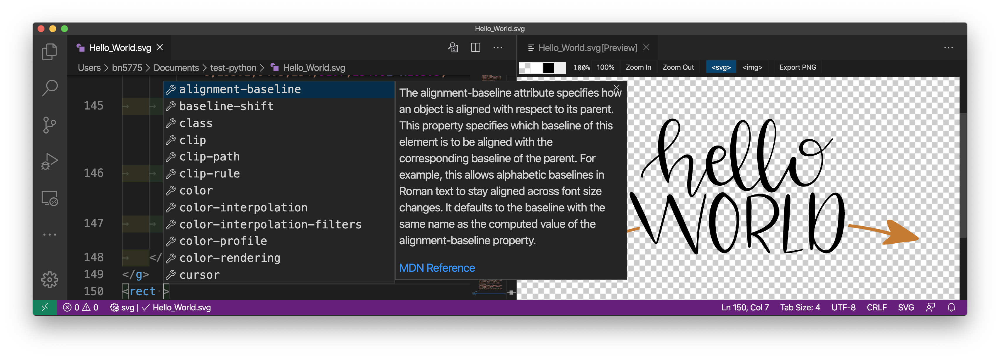
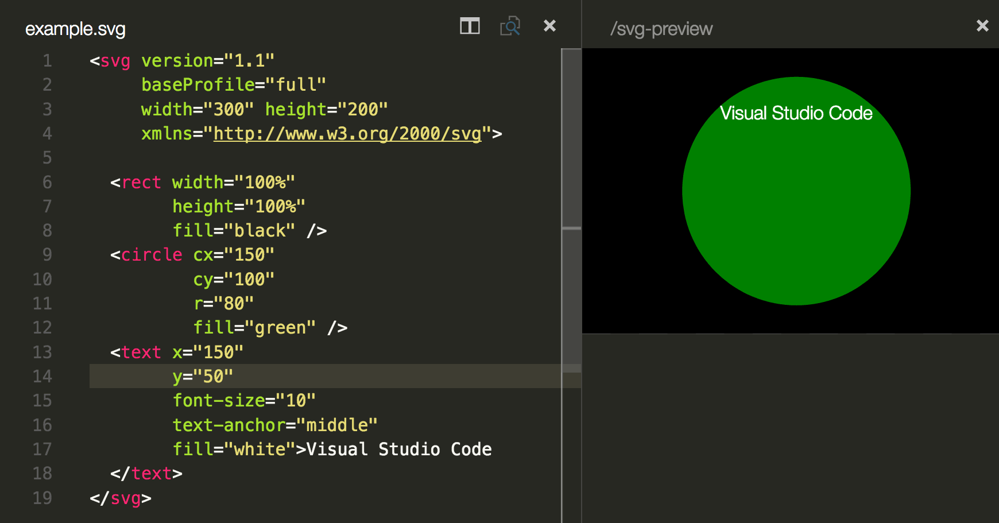

# Visual Studio Code - VS Code


[Visual Studio Code](https://code.visualstudio.com/) is a lightweight but powerful source code editor which runs on your desktop and is available for Windows, macOS and Linux.

## Install VS Code

[Download VS Code](https://code.visualstudio.com/download) - quickly find the appropriate install for your platform (Windows, macOS and Linux).

## Edit the VS Code settings

To edit the VS Code settings:

1. Open the Command Palette (⇧⌘P) and type `settings`
2. Then select the option `Preferences: Open Settings (JSON)`
3. Check out my personal VS Code settings

    Required only if you use Oh My Zsh + Powerlevel9k + Nerd font:

    ```json
    "terminal.integrated.fontFamily": "Hack Nerd Font",
    ```

    General settings:

   ```json
    "terminal.integrated.fontSize": 14,

    "window.zoomLevel": 0,

    "editor.fontSize": 16,
    "editor.rulers": [80, 120],
    "editor.renderWhitespace": "all",
    "editor.renderControlCharacters": true,
    "editor.wordWrap":"on",

    "[markdown]": {
        "editor.defaultFormatter": "yzhang.markdown-all-in-one"
    },
    "markdown-pdf.highlightStyle": "github.css",
    "cSpell.language": "en,fr",

    "python.venvPath": "~/.virtualenvs/",
   ```

## Add VS Code command to Terminal

You can run VS Code from Terminal by typing `code` after adding it to the PATH:

1. Launch VS Code
2. Open the Command Palette (⇧⌘P) and type `shell command`
3. Select the option `Install 'code' command in PATH`
4. Restart the terminal application to update the PATH

You will be able to type `code .` in any folder to start editing files in that folder.

## Define the VS Code as default git editor and diff tool

Paste that in the terminal:

```bash
# Set Code as default git editor
git config --global core.editor 'code --wait'
```

```bash
# Set Code as diff tool
git config --global diff.tool vscode
git config --global difftool.vscode.cmd 'code --wait --diff $LOCAL $REMOTE'
```

## Using VS Code with particular technologies

Microsoft created a collection of recipes for using VS Code with particular technologies (mostly Web).

Make sure to visit it at [Microsoft/vscode-recipes](https://github.com/Microsoft/vscode-recipes).

## VS Code Extensions


The features that Visual Studio Code includes out-of-the-box are just the start. VS Code extensions let you add languages, debuggers, and tools to your installation to support your development workflow.

### Browse for extensions


You can browse and install extensions from within VS Code. Bring up the Extensions view by clicking on the Extensions icon in the Activity Bar on the side of VS Code or the View: Extensions command (⇧⌘X).

This will show you a list of the most popular VS Code extensions on the [VS Code Marketplace](https://marketplace.visualstudio.com/VSCode).

## Install extensions

When using the [VS Code Marketplace](https://marketplace.visualstudio.com/VSCode) or browsing for extensions into the VS Code, just click on the option `Install` to install the extension.

Alternatively, you can use the terminal command:

```bash
code --install-extension extension-name
```

### Install extensions using mac-dev-setup install

```bash
bash <(curl -fsSL raw.githubusercontent.com/mgomesborges/mac-dev-setup/master/install) vscode
```

## Visual Studio IntelliCode


[Visual Studio IntelliCode](https://marketplace.visualstudio.com/items?itemName=VisualStudioExptTeam.vscodeintellicode) provides AI-assisted development features for Python, TypeScript/JavaScript and Java developers in Visual Studio Code, with insights based on understanding your code context combined with machine learning.

```bash
code --install-extension VisualStudioExptTeam.vscodeintellicode
```

The example below shows IntelliCode in action for Python code:


## Code Spell Checker


[Code Spell Checker](https://marketplace.visualstudio.com/items?itemName=streetsidesoftware.code-spell-checker) is a basic spell checker that catch common spelling errors while keeping the number of false positives low.

Supported Languages:

* English (US) - default
* English (GB) - add to VS Code settings: "cSpell.language": "en-GB",
* [Dutch](https://marketplace.visualstudio.com/items?itemName=streetsidesoftware.code-spell-checker-dutch)
* [Catalan](https://marketplace.visualstudio.com/items?itemName=streetsidesoftware.code-spell-checker-catalan)
* [Czech](https://marketplace.visualstudio.com/items?itemName=streetsidesoftware.code-spell-checker-czech)
* [French](https://marketplace.visualstudio.com/items?itemName=streetsidesoftware.code-spell-checker-french)
* [German](https://marketplace.visualstudio.com/items?itemName=streetsidesoftware.code-spell-checker-german)
* [Russian](https://marketplace.visualstudio.com/items?itemName=streetsidesoftware.code-spell-checker-russian)
* [Spanish](https://marketplace.visualstudio.com/items?itemName=streetsidesoftware.code-spell-checker-spanish)
* [Swedish](https://marketplace.visualstudio.com/items?itemName=streetsidesoftware.code-spell-checker-swedish)
* [Medical Terms](https://marketplace.visualstudio.com/items?itemName=streetsidesoftware.code-spell-checker-medical-terms)

```bash
code --install-extension streetsidesoftware.code-spell-checker
```

### Install French - Code Spell Checker

1. Install French dictionary:

    ```bash
    code --install-extension streetsidesoftware.code-spell-checker-french
    ```

2. Edit the VS Code settings:

    ```bash
    "cSpell.language": "en,fr",
    ```

## Prettier - Code formatter


[Prettier](https://marketplace.visualstudio.com/items?itemName=esbenp.prettier-vscode) - code formatter using prettier.io

```bash
code --install-extension esbenp.prettier-vscode
```

## Bracket Pair Colorizer 2


[Bracket Pair Colorizer](https://marketplace.visualstudio.com/items?itemName=CoenraadS.bracket-pair-colorizer-2) is a customizable extension for colorizing matching brackets.

```bash
code --install-extension CoenraadS.bracket-pair-colorizer-2
```

## Better Comments


[Better Comments](https://marketplace.visualstudio.com/items?itemName=aaron-bond.better-comments) will help you improve your code commenting by annotating with alert, informational, TODOs, and more!

```bash
code --install-extension aaron-bond.better-comments
```

## indent-rainbow


[indent-rainbow](https://marketplace.visualstudio.com/items?itemName=oderwat.indent-rainbow) makes indentation easier to read.

```bash
code --install-extension oderwat.indent-rainbow
```

## Path Intellisense


[Path Intellisense](https://marketplace.visualstudio.com/items?itemName=christian-kohler.path-intellisense) autocompletes path filenames.

```bash
code --install-extension christian-kohler.path-intellisense
```


## GitLens — Git supercharged


[GitLens](https://marketplace.visualstudio.com/items?itemName=eamodio.gitlens) supercharges the Git capabilities built into Visual Studio Code.

```bash
code --install-extension eamodio.gitlens
```

## Git History


[Git History](https://marketplace.visualstudio.com/items?itemName=donjayamanne.githistory) - view git log, file history, compare branches or commits.

```bash
code --install-extension donjayamanne.githistory
```

## Markdown All in One


[Markdown All in One](https://marketplace.visualstudio.com/items?itemName=yzhang.markdown-all-in-one) is all you need for Markdown (keyboard shortcuts, table of contents, auto preview and more).

```bash
code --install-extension yzhang.markdown-all-in-one
```

## markdownlint


[markdownlint](https://marketplace.visualstudio.com/items?itemName=DavidAnson.vscode-markdownlint) is Markdown/CommonMark linting and style checking.

```bash
code --install-extension DavidAnson.vscode-markdownlint
```

## Markdown Preview Github Styling


[Github Styling](https://marketplace.visualstudio.com/items?itemName=bierner.markdown-preview-github-styles) changes VS Code's built-in markdown preview to match Github's style.

```bash
code --install-extension bierner.markdown-preview-github-styles
```

## Markdown Emoji


[Markdown Emoji](https://marketplace.visualstudio.com/items?itemName=bierner.markdown-emoji) adds emoji syntax support to VS Code's built-in markdown preview.

```bash
code --install-extension bierner.markdown-emoji
```

## Markdown PDF


[Markdown PDF](https://marketplace.visualstudio.com/items?itemName=yzane.markdown-pdf) converts converts Markdown files to pdf, html, png or jpeg files.

```bash
code --install-extension yzane.markdown-pdf
```

### Activate Github theme

Edit the VS Code settings:

```bash
"markdown-pdf.highlightStyle": "github.css",
```

### Enable LaTeX equations

Paste that in the terminal:

```bash
read -r -d '' SCRIPT <<"EOF"
<script type="text/javascript" src="http://cdn.mathjax.org/mathjax/latest/MathJax.js?config=TeX-AMS-MML_HTMLorMML">
</script>
<script type="text/x-mathjax-config">
    MathJax.Hub.Config({ tex2jax: {inlineMath: [['$', '$']]}, messageStyle: 'none' });
</script>
EOF

MARKDOWN_PDF=$(echo ${HOME}/.vscode/extensions/yzane.markdown-pdf-*/template/template.html)

echo "${SCRIPT}" >> "${MARKDOWN_PDF}"
```

## HTML CSS Support


[HTML CSS Support](https://marketplace.visualstudio.com/items?itemName=ecmel.vscode-html-css) is the missing CSS support for HTML documents.

```bash
code --install-extension ecmel.vscode-html-css
```

## jshint


[JSHint](https://marketplace.visualstudio.com/items?itemName=dbaeumer.jshint) is a linter for JavaScript.

```bash
code --install-extension dbaeumer.jshint
```

## ESLint


[ESLint](https://marketplace.visualstudio.com/items?itemName=dbaeumer.vscode-eslint) find and fix problems in your JavaScript code.

```bash
code --install-extension dbaeumer.vscode-eslint
```

## React Native Tools


[React Native Tools](https://marketplace.visualstudio.com/items?itemName=msjsdiag.vscode-react-native) - debugging and integrated commands for React Native.

```bash
code --install-extension msjsdiag.vscode-react-native
```

## Debugger for Chrome


[Debugger for Chrome](https://marketplace.visualstudio.com/items?itemName=msjsdiag.debugger-for-chrome) allows you debug your JavaScript code in the Chrome browser, or any other target that supports the Chrome Debugger protocol.

```bash
code --install-extension msjsdiag.debugger-for-chrome
```


## Live Server


[Live Server](https://marketplace.visualstudio.com/items?itemName=ritwickdey.LiveServer) launches a local development Server with reloading feature for static & dynamic pages.

```bash
code --install-extension ritwickdey.LiveServer
```


## npm


[npm](https://marketplace.visualstudio.com/items?itemName=eg2.vscode-npm-script) support for VS Code.

```bash
code --install-extension eg2.vscode-npm-script
```

## REST Client


[REST Client](https://marketplace.visualstudio.com/items?itemName=humao.rest-client) for Visual Studio Code.

```bash
code --install-extension humao.rest-client
```


## Remote - SSH


[Remote - SSH](https://marketplace.visualstudio.com/items?itemName=ms-vscode-remote.remote-ssh) opens any folder on a remote machine using SSH and take advantage of VS Code's full feature set.

No source code needs to be on your local machine to gain these benefits since the extension runs commands and other extensions directly on the remote machine. You can open any folder on the remote machine and work with it just as you would if the folder were on your own machine.

```bash
code --install-extension ms-vscode-remote.remote-ssh
```

## Python


[Python](https://marketplace.visualstudio.com/items?itemName=ms-python.python) - Linting, Debugging (multi-threaded, remote), Intellisense, Jupyter Notebooks, code formatting, refactoring, unit tests, snippets, and more.

```bash
code --install-extension ms-python.python
```

The example below shows Python extension with native Jupyter Notebook edition:


## C/C++


[C/C++](https://marketplace.visualstudio.com/items?itemName=ms-vscode.cpptools) IntelliSense, debugging, and code browsing.

```bash
code --install-extension ms-vscode.cpptools
```

## Go


[Go](https://marketplace.visualstudio.com/items?itemName=ms-vscode.Go) language support for Visual Studio Code.

```bash
code --install-extension ms-vscode.Go
```

## Java by Red Hat


[Java by Red Hat](https://marketplace.visualstudio.com/items?itemName=redhat.java) - Java Linting, Intellisense, formatting, refactoring, Maven/Gradle support and more.

```bash
code --install-extension redhat.java
```

## Docker


[Docker](https://marketplace.visualstudio.com/items?itemName=ms-azuretools.vscode-docker) adds syntax highlighting, commands, hover tips, and linting for Dockerfile and docker-compose files.

Check out the [Working with Docker](https://code.visualstudio.com/docs/azure/docker) tutorial to get started.

```bash
code --install-extension ms-azuretools.vscode-docker
```

## YAML


[YAML](https://marketplace.visualstudio.com/items?itemName=redhat.vscode-yaml) Language Support by Red Hat, with built-in Kubernetes and Kedge syntax support.

```bash
code --install-extension redhat.vscode-yaml
```

## CMake


[CMake](https://marketplace.visualstudio.com/items?itemName=twxs.cmake) langage support for Visual Studio Code.

```bash
brew install cmake
```

```bash
code --install-extension twxs.cmake
```


## CMake Tools


[CMake Tools](https://marketplace.visualstudio.com/items?itemName=ms-vscode.cmake-tools) provides the native developer a full-featured, convenient, and powerful workflow for CMake-based projects.

```bash
brew install cmake
```

```bash
code --install-extension ms-vscode.cmake-tools
```


## SVG


[SVG](https://marketplace.visualstudio.com/items?itemName=jock.svg) - A Powerful SVG Language Support Extension. Almost all the features you need to handle SVG.

```bash
code --install-extension jock.svg
```



## SVG Viewer


[SVG Viewer](https://marketplace.visualstudio.com/items?itemName=cssho.vscode-svgviewer) - view an SVG in the editor and export it as data URI scheme or PNG.

```bash
code --install-extension cssho.vscode-svgviewer
```



## LaTeX Workshop


[LaTeX Workshop](https://marketplace.visualstudio.com/items?itemName=James-Yu.latex-workshop) boosts LaTeX typesetting efficiency with preview, compile, autocomplete, colorize, and more.

:warning: LaTeX Workshop requires [LaTeX MacTex](../README.md#latex---mactex-optional).

```bash
code --install-extension James-Yu.latex-workshop
```


### Configure LaTeX Workshop

1. Be sure to create a directory called `build` in the same place of your LaTeX files
2. Copy my recipe to your VS Code settings

```json
    "latex-workshop.view.pdf.viewer": "tab",
    "latex-workshop.latex.autoBuild.run": "never",
    "latex-workshop.latex.outDir": "./build/",
    "latex-workshop.latex.recipes": [
        {
            "name": "latexmk",
            "tools": ["latexmk"]
        },
        {
            "name": "pdflatex -> bibtex -> pdflatex*2",
            "tools": ["pdflatex","bibtex","pdflatex","pdflatex"]
        },
        {
            "name": "pdflatex -> biber -> pdflatex*2",
            "tools": ["pdflatex","biber","pdflatex","pdflatex"]
        },
        {
            "name": "pdflatex -> glossaries -> bibtex -> pdflatex*2",
            "tools": ["pdflatex","makeglossaries","bibtex","pdflatex","pdflatex"]
        },
        {
            "name": "pdflatex -> glossaries -> biber -> pdflatex*2",
            "tools": ["pdflatex","makeglossaries","biber","pdflatex","pdflatex"]
        }
    ],

    "latex-workshop.latex.tools": [
        {
            "name": "latexmk",
            "command": "latexmk",
            "args": [
                "-synctex=1",
                "-interaction=nonstopmode",
                "-output-directory=build",
                "-file-line-error",
                "-pdf",
                "%DOC%"
            ]
        },
        {
            "name": "pdflatex",
            "command": "pdflatex",
            "args": [
                "-synctex=1",
                "-interaction=nonstopmode",
                "-file-line-error",
                "-output-directory=build",
                "%DOC%"
            ]
        },
        {
            "name": "makeglossaries",
            "command": "makeglossaries",
            "args": ["-d","./build","%DOCFILE%"]
        },
        {
            "name": "bibtex",
            "command": "bibtex",
            "args": ["./build/%DOCFILE%"]
        },
        {
            "name": "biber",
            "command": "biber",
            "args": ["./build/%DOCFILE%"]
        }
    ],
```
